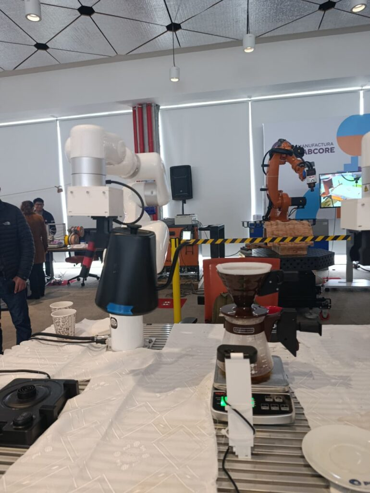

# Joaquín Pozo

Robotics and Control Engineer focused on **autonomous systems, embedded control, and intelligent robotic platforms**.

---

## About Me
Joaquín Pozo is a mechatronics engineer who designs and develops experimental robotic platforms, building integrated mechanical, electronic, and control architectures from concept definition to experimental validation. His work centers on the development of real-world engineering systems, with emphasis on hardware–software integration, embedded control, and system-level prototyping for robotic applications.

**Interests**
- Autonomous robotic systems
- Embedded systems
- Control engineering

**Links**
- LinkedIn: [Coming soon]
- CV: [Coming soon]

---

## Education
**B.Sc. Mechatronics Engineering, 2021**  
Pontificia Universidad Católica del Perú (PUCP)

---

# Featured Projects

---

## Robotic Coffee Preparation Station

Autonomous robotic system capable of preparing pour-over coffee using coordinated robotic arms, machine vision, and state-machine based control.

GitHub repository: *Coming soon*

<!-- GitHub link placeholder -->
<!-- https://github.com/username/project -->

---

## Differential Drive Autonomous Robot

Mobile robot designed for trajectory tracking in maze environments using cascaded PID control, odometry estimation, and real-time embedded implementation.

Video: [Trayectory tracking in final course maze](images/diff_video.mp4)

---

## CubeSat Attitude Control System

Simulation and control design for CubeSat attitude stabilization using nonlinear spacecraft dynamics and advanced control techniques.

Paper: 

---

## Future Project — Autonomous Underwater Vehicle (AUV)

Conceptual design of an autonomous underwater vehicle for hull inspection in maritime environments.

Paper: *Coming soon*
